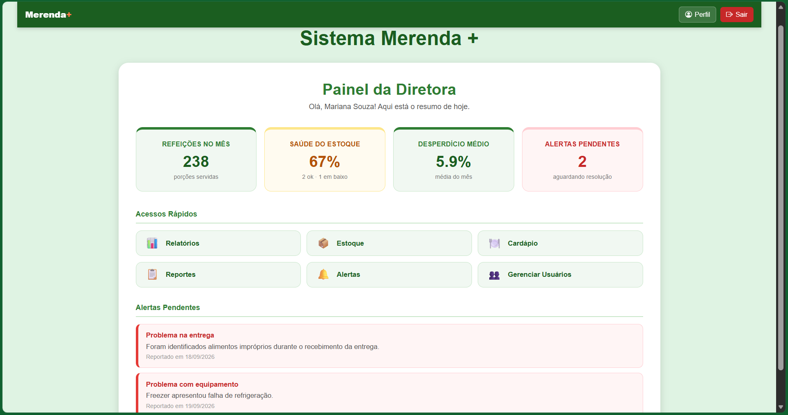
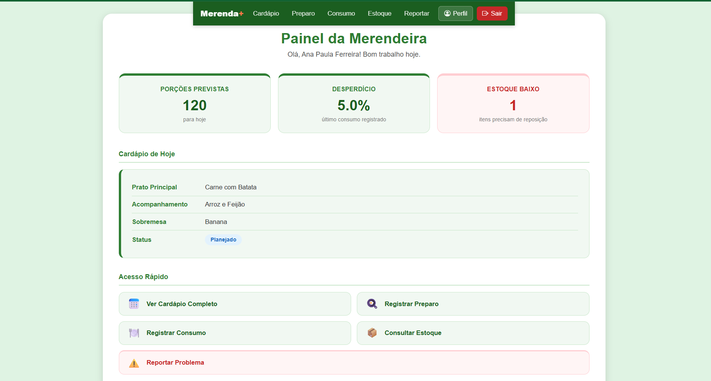
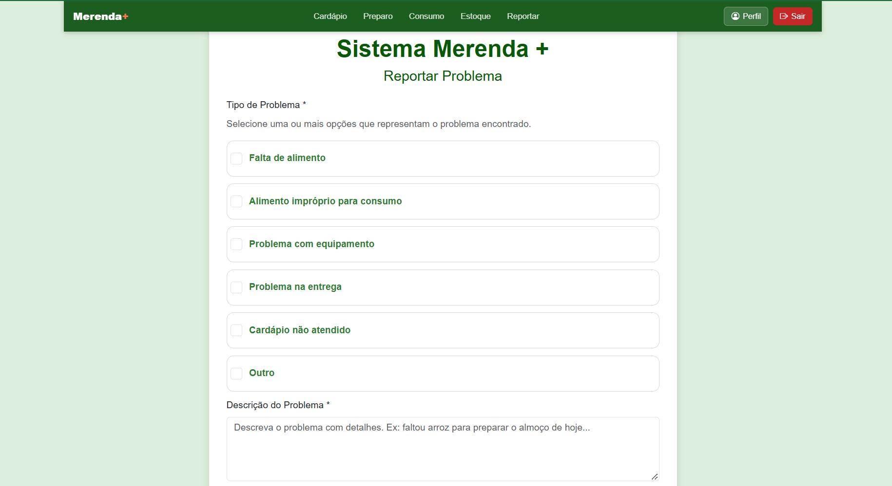
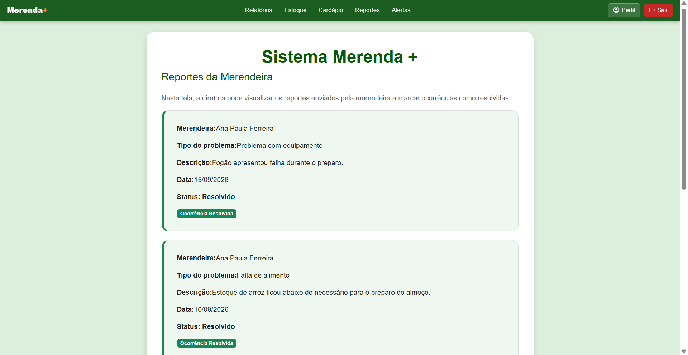
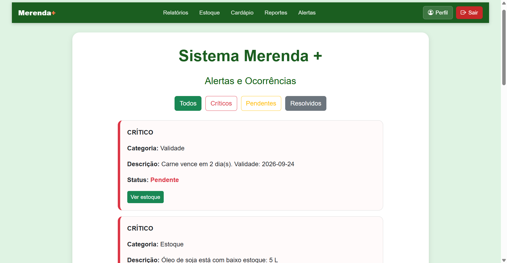
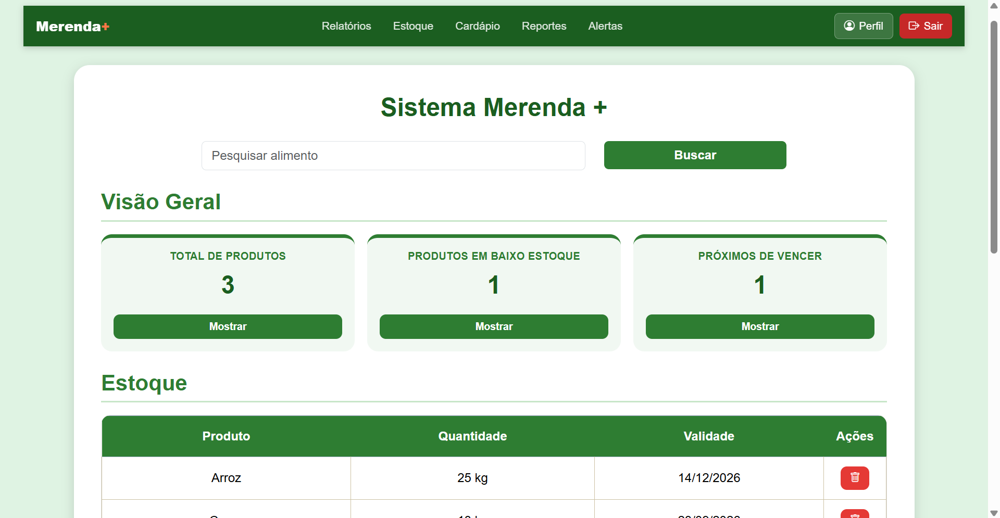
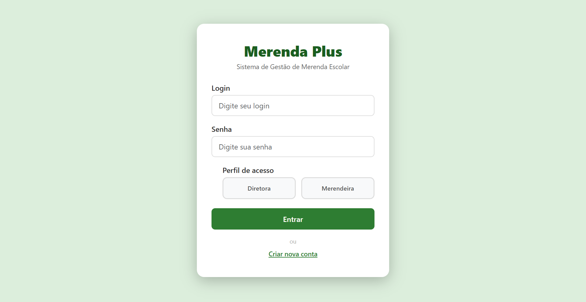

# Merenda+

Sistema web para apoiar a gestão da merenda escolar, centralizando informações de estoque, cardápios, consumo, ocorrências e acompanhamento da operação entre merendeiras e direção escolar.

O projeto foi desenvolvido no **1º período de Engenharia de Software da PUC Minas**, durante a disciplina **Trabalho Interdisciplinar 1**, no primeiro semestre de 2026.

A proposta surgiu da necessidade de substituir controles manuais e informações dispersas por um fluxo digital simples, permitindo acompanhar desde a preparação das refeições até problemas operacionais e alertas relacionados ao estoque.

<p align="center">
  
</p>

---

## Sobre o projeto

O **Merenda+** foi desenvolvido para auxiliar a rotina de escolas públicas municipais na gestão da alimentação escolar.

A aplicação possui dois perfis principais:

- **Merendeira**, responsável pelo acompanhamento da rotina operacional, registro de consumo, preparação das refeições, consulta ao estoque e reporte de problemas.
- **Diretora**, responsável por acompanhar indicadores, estoque, cardápios, relatórios, alertas e ocorrências reportadas pela equipe.

A separação entre os perfis permite que cada usuário tenha acesso às informações e ações relacionadas às suas responsabilidades dentro da operação.

---

## Funcionalidades

### Merendeira

- Visualização do cardápio e refeições previstas.
- Consulta ao estoque.
- Registro de preparação das refeições.
- Registro de consumo e desperdício.
- Reporte de problemas e ocorrências.
- Consulta e edição do perfil.
- Navegação adaptada ao perfil da merendeira.

### Diretora

- Dashboard com indicadores da operação.
- Gerenciamento e acompanhamento do estoque.
- Visualização de cardápios.
- Acompanhamento de relatórios.
- Visualização de reportes enviados pelas merendeiras.
- Classificação e resolução de ocorrências.
- Alertas automáticos relacionados ao estoque.
- Histórico de ocorrências resolvidas.
- Consulta e edição do perfil.

---

## Perfis da aplicação

<table>
  <tr>
    <td align="center"><strong>Merendeira</strong></td>
    <td align="center"><strong>Diretora</strong></td>
  </tr>
  <tr>
    <td>
      
    </td>
    <td>
      
    </td>
  </tr>
</table>

Cada perfil possui navegação, informações e funcionalidades específicas, mantendo uma interface adequada às atividades realizadas por cada tipo de usuário.

---

## Fluxo de reportes e ocorrências

Um dos fluxos implementados no projeto permite acompanhar uma ocorrência desde o seu registro até sua resolução.

```text
Merendeira identifica um problema
            ↓
Registra uma ocorrência
            ↓
Diretora recebe o reporte
            ↓
Analisa as informações
            ↓
Marca a ocorrência como resolvida
            ↓
Registro é armazenado no histórico
```

### Registro pela merendeira

A merendeira pode informar problemas encontrados durante a operação, selecionando o tipo da ocorrência e adicionando uma descrição.

<p align="center">
  
</p>

### Acompanhamento pela direção

Os reportes ficam disponíveis para acompanhamento pela diretora, permitindo visualizar informações da ocorrência e registrar sua resolução.

<p align="center">
  
</p>

---

## Alertas e controle de estoque

O sistema também utiliza os dados do estoque para identificar situações que precisam de atenção.

Entre elas:

- produtos com estoque baixo;
- produtos próximos da validade;
- ocorrências pendentes reportadas pelas merendeiras.

<p align="center">
  
</p>

Os alertas permitem direcionar a diretora para as informações relacionadas no estoque.

<p align="center">
  
</p>

---

## Tecnologias utilizadas

O projeto foi desenvolvido com:

- **HTML5** — estrutura das páginas.
- **CSS3** — estilização e responsividade.
- **JavaScript** — regras de negócio e interação com a interface.
- **Bootstrap 5** — componentes e apoio à construção da interface.
- **Node.js** — ambiente de execução da aplicação.
- **JSON Server** — API REST utilizada para persistência dos dados durante o desenvolvimento.

A comunicação entre o frontend e os dados é realizada por requisições HTTP ao JSON Server.

---

## Minha contribuição

Este foi um projeto desenvolvido em equipe. Durante o desenvolvimento, fiquei responsável principalmente pela implementação e integração do fluxo de **reportes, alertas e ocorrências**, além de participar da organização e integração final da aplicação.

Entre minhas principais contribuições estão:

- Desenvolvimento da funcionalidade de **reporte de problemas pela merendeira**.
- Integração dos reportes com o JSON Server.
- Desenvolvimento da visualização de **reportes pela diretora**.
- Implementação da resolução das ocorrências e atualização de status.
- Integração das ocorrências resolvidas com o **histórico de alertas**.
- Desenvolvimento da tela de **Alertas e Ocorrências** da diretora.
- Implementação de alertas automáticos para:
  - estoque baixo;
  - produtos próximos da validade.
- Integração entre alertas e a tela de estoque.
- Participação na implementação do login e diferenciação dos perfis **Merendeira/Diretora**.
- Desenvolvimento e ajustes na interface e navegação da merendeira.
- Reorganização da estrutura de arquivos e módulos do projeto.
- Integração das diferentes partes da aplicação durante a etapa final.
- Apoio na resolução de conflitos Git, organização da entrega e documentação.

Esse trabalho permitiu praticar não apenas desenvolvimento frontend, mas também integração entre funcionalidades, persistência de dados, organização de código e trabalho colaborativo utilizando Git.

---

## Arquitetura e persistência

A aplicação utiliza uma arquitetura simples adequada ao objetivo acadêmico do projeto.

```text
Interface Web
HTML + CSS + JavaScript
        │
        │ HTTP / Fetch API
        ▼
JSON Server
        │
        ▼
     db.json
```

O arquivo `db.json` funciona como base de dados da aplicação durante a demonstração.

Entre os dados armazenados estão:

- usuários;
- estoque;
- cardápios;
- preparações;
- consumo;
- relatórios;
- reportes de problemas;
- histórico de alertas.

---

## Como executar

### Pré-requisitos

É necessário ter o **Node.js** e o **npm** instalados.

### 1. Clone o repositório

```bash
git clone <URL-DO-REPOSITORIO>
```

### 2. Entre na aplicação

```bash
cd merenda-plus/codigo
```

### 3. Instale as dependências

```bash
npm install
```

### 4. Inicie o servidor

```bash
npm start
```

### 5. Acesse

Abra no navegador:

```text
http://localhost:3000
```

---

## Credenciais de demonstração

Para facilitar a avaliação do projeto, existem dois usuários fictícios preparados para demonstração.

| Perfil | Usuário | Senha |
|---|---|---|
| Diretora | `diretora` | `123` |
| Merendeira | `merendeira` | `123` |

<p align="center">
  
</p>

> Os usuários, credenciais e demais informações presentes na base de demonstração são fictícios e destinados exclusivamente à apresentação do projeto.

---

## Estrutura do projeto

```text
Merenda+
├── codigo/
│   ├── db/
│   │   └── db.json
│   ├── public/
│   │   ├── assets/
│   │   │   ├── css/
│   │   │   └── js/
│   │   └── modulos/
│   │       ├── diretora/
│   │       ├── login/
│   │       └── merendeira/
│   ├── index.js
│   ├── package.json
│   └── README.md
│
├── docs/
│   ├── portfolio/
│   │   └── screenshots/
│   └── ...
│
├── README.md
├── LICENSE
└── CITATION.cff
```

O diretório `codigo/` contém a aplicação, enquanto `docs/` reúne materiais produzidos durante o processo acadêmico e os recursos utilizados na apresentação do projeto.

Para informações mais técnicas sobre a execução e estrutura da aplicação, consulte [`codigo/README.md`](codigo/README.md).

---

## Contexto acadêmico

O Merenda+ foi desenvolvido como projeto do **Trabalho Interdisciplinar 1** do curso de **Engenharia de Software da PUC Minas**, durante o primeiro semestre de 2026.

O projeto fez parte do processo de aprendizagem do primeiro período e envolveu etapas como:

- definição do problema;
- levantamento de necessidades dos usuários;
- construção de personas;
- prototipação e wireframes;
- desenvolvimento incremental;
- integração das funcionalidades;
- testes;
- documentação;
- apresentação da solução.

Os materiais produzidos durante esse processo estão preservados no diretório [`docs/`](docs/).

---

## Equipe

Projeto desenvolvido por:

- André Luiz Pinheiro Lopes
- Davi Lavalle Carneiro
- Gabriel Tavares Pandino
- Gustavo Alves Costa Sousa

### Professores responsáveis

- Cleiton Silva Tavares
- Diego Augusto de Faria Barros
- Rommel Vieira Carneiro
- Roselene Henrique Pereira Costa

---

## Limitações e propósito

O Merenda+ é um **projeto acadêmico e demonstrativo**, desenvolvido durante o primeiro período da graduação.

A autenticação utilizada na aplicação é simplificada e realizada no cliente, e os dados são persistidos utilizando JSON Server. Essas escolhas foram adequadas ao escopo e aos objetivos de aprendizagem do projeto, mas **não representam uma arquitetura de autenticação ou persistência indicada para um ambiente de produção**.

O repositório preserva essa arquitetura para manter a fidelidade ao projeto desenvolvido durante a disciplina.

---

## Evolução do projeto

Esta versão do repositório recebeu uma etapa posterior de organização para apresentação em portfólio, incluindo:

- limpeza de arquivos acadêmicos não utilizados pela aplicação;
- organização da documentação;
- preparação de dados fictícios para demonstração;
- correções pontuais de navegação e interface;
- padronização de textos e metadados;
- documentação técnica;
- screenshots da aplicação.

A arquitetura e as tecnologias originais foram preservadas para que o projeto continue representando de forma fiel o trabalho realizado durante o primeiro período da graduação.
