# Introdução

Informações básicas do projeto.

* **Projeto:** Merenda Plus
* **Repositório GitHub:** https://github.com/ICEI-PUC-Minas-PPLES-TI/plf-es-2026-1-ti1-7620100-merenda-plus
* **Membros da equipe:**

  * [André Luiz Pinheiro Lopes](https://github.com/decoprodat)
  * [Davi Lavalle Carneiro](https://github.com/davicarneiro1558195-sys)
  * [Gabriel Tavares Pandino](https://github.com/gabrielpandino-puc)
  * [Gustavo Alves Costa Sousa](https://github.com/alvespcrl)
  * [Pedro Ferretti Martins Maia](https://github.com/pedroferretti31)

A documentação do projeto é estruturada da seguinte forma:

1. Introdução
2. Contexto
3. Product Discovery
4. Product Design (**A entrega da fase de Concepção finaliza aqui**)
5. Metodologia
6. Solução
7. Referências Bibliográficas

✅ [Documentação de Design Thinking (MIRO)](https://miro.com/app/dashboard/)

# Contexto

O presente projeto tem como foco o desenvolvimento de um sistema web de gestão de merenda escolar voltado para escolas públicas municipais. A proposta surgiu a partir da identificação de problemas recorrentes relacionados à ausência de registros organizados da demanda de merenda, dificultando o controle de estoque, o acompanhamento do consumo e a organização da distribuição dos alimentos dentro das instituições de ensino.

Atualmente, muitas escolas ainda realizam o controle da merenda de forma manual, utilizando anotações em papel ou processos descentralizados, o que pode gerar inconsistências nas informações, desperdício de alimentos, falta de insumos e dificuldades no planejamento das refeições. Além disso, a ausência de dados confiáveis compromete a tomada de decisões por parte da direção escolar e dos responsáveis pela alimentação.

Com base nas pesquisas realizadas pelo grupo, incluindo análise de stakeholders, definição de personas, levantamento de dores e necessidades dos usuários, foi identificado que tanto gestores escolares quanto merendeiras enfrentam dificuldades no acompanhamento da quantidade de alimentos disponíveis, na previsão da demanda diária e na organização dos registros de consumo e preparo das refeições.

Dessa forma, o sistema proposto busca centralizar e digitalizar essas informações, oferecendo funcionalidades como controle de estoque, registro de preparo e consumo, acompanhamento de cardápio, geração de relatórios e alertas operacionais. A solução foi pensada para ser simples, acessível e prática, considerando a realidade das escolas públicas e a rotina dos profissionais envolvidos.

O projeto possui caráter funcional e pretende entregar uma solução web utilizável, focada inicialmente em atender individualmente cada escola, permitindo uma gestão mais organizada, transparente e eficiente da merenda escolar.

## Problema

Ausência de registros estruturados e organização da demanda de merenda em escolas públicas municipais, ocasionando desperdícios, dificuldades no controle de estoque, falhas no acompanhamento do consumo e ineficiência na gestão da alimentação escolar.

## Objetivos

Desenvolver um sistema web de gestão de merenda escolar que permita o controle eficiente do estoque, do preparo, da distribuição e do consumo de alimentos, contribuindo para a redução de desperdícios e para a melhoria da organização dos processos alimentares nas instituições públicas de ensino.

Objetivos especificos:
-Digitalizar os registros relacionados à merenda escolar;
-Facilitar o controle de estoque e validade dos alimentos;
-Permitir o registro diário de preparo e consumo das refeições;
-Auxiliar na organização e acompanhamento da demanda alimentar;
-Gerar relatórios e informações para apoio à gestão escolar;
-Reduzir desperdícios causados pela falta de controle e planejamento;
-Melhorar a comunicação entre direção escolar e equipe responsável pela merenda.

## Justificativa

A gestão da merenda escolar é um aspecto fundamental para o bom funcionamento das instituições de ensino, uma vez que está diretamente relacionada à alimentação dos estudantes e à qualidade do ambiente educacional. No entanto, muitas escolas públicas ainda enfrentam dificuldades no controle de estoque, na organização da distribuição de alimentos e no monitoramento do consumo, principalmente devido à ausência de registros estruturados e ferramentas adequadas de gerenciamento.

Esse cenário pode ocasionar desperdício de alimentos, falta de insumos, problemas no planejamento das refeições e dificuldades na tomada de decisões por parte da gestão escolar. Além disso, processos realizados manualmente tornam o acompanhamento das informações mais lento, sujeito a erros e pouco eficiente.

Diante dessa realidade, torna-se relevante o desenvolvimento de um sistema web que auxilie no gerenciamento da merenda escolar, proporcionando maior controle sobre os alimentos disponíveis, sua validade, distribuição e consumo. A proposta deste projeto justifica-se pela necessidade de otimizar processos internos, reduzir desperdícios e garantir maior eficiência na utilização dos recursos destinados à alimentação escolar.

O sistema também busca beneficiar diretamente diretores, merendeiras e demais profissionais envolvidos no processo alimentar das escolas, oferecendo uma solução simples, acessível e organizada para o registro das informações do dia a dia. Dessa forma, o projeto apresenta relevância prática, social e tecnológica, ao propor uma ferramenta capaz de melhorar a gestão da alimentação escolar e contribuir para a qualidade do serviço prestado aos alunos.

## Público-Alvo

O público-alvo do sistema são escolas públicas municipais, especialmente diretores escolares e profissionais responsáveis pela merenda escolar, como merendeiras e equipes de alimentação, que necessitam de maior organização e controle dos processos relacionados à alimentação dos estudantes.

# Product Discovery

## Etapa de Entendimento

## Etapa de Definição

### Personas

# Product Design

Nesse momento, vamos transformar os insights e validações obtidos em soluções tangíveis e utilizáveis. Essa fase envolve a definição de uma proposta de valor, detalhando a prioridade de cada ideia e a consequente criação de wireframes, mockups e protótipos de alta fidelidade, que detalham a interface e a experiência do usuário.

## Histórias de Usuários

Com base na análise das personas foram identificadas as seguintes histórias de usuários:

| EU COMO (PERSONA) | QUERO/PRECISO (FUNCIONALIDADE) | PARA (MOTIVO/VALOR) |
|------------------|--------------------------------|---------------------|
| Diretora | visualizar um painel com informações da merenda | tomar decisões mais rápidas e seguras |
| Diretora | acessar relatórios de consumo | analisar o uso dos alimentos ao longo do tempo |
| Diretora | acompanhar a distribuição da merenda | garantir que todos os alunos sejam atendidos corretamente |
| Diretora | controlar o estoque de alimentos | evitar desperdícios e falta de produtos |
| Diretora | registrar digitalmente a movimentação dos alimentos | reduzir erros e dependência de anotações manuais |
| Diretora | receber alertas sobre problemas no estoque ou consumo | agir rapidamente quando necessário |
| Merendeira | visualizar o cardápio do dia | preparar corretamente as refeições planejadas |
| Merendeira | registrar o preparo das refeições | manter controle do que foi produzido |
| Merendeira | informar quando um alimento estiver em falta | evitar problemas no preparo das refeições |
| Merendeira | consultar o estoque disponível | saber quais alimentos posso utilizar |
| Merendeira | registrar o uso dos alimentos | manter o estoque sempre atualizado |
| Merendeira | receber orientações sobre o preparo das refeições | garantir qualidade e padrão na alimentação |

## Propostas de valor

## Projeto de Interface

Artefatos relacionados com a interface e a interacão do usuário na proposta de solução.

### Wireframes

Estes são os protótipos de telas do sistema.

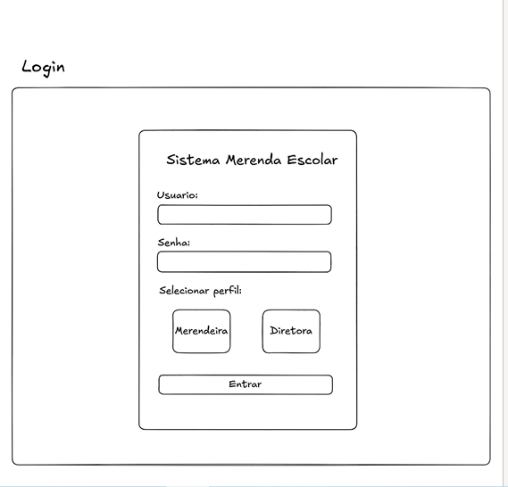
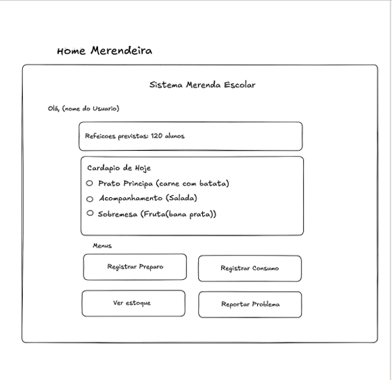
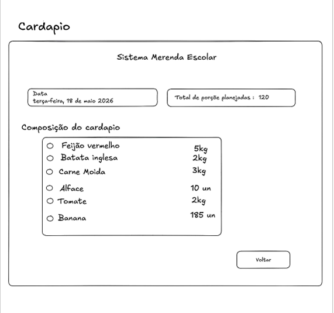
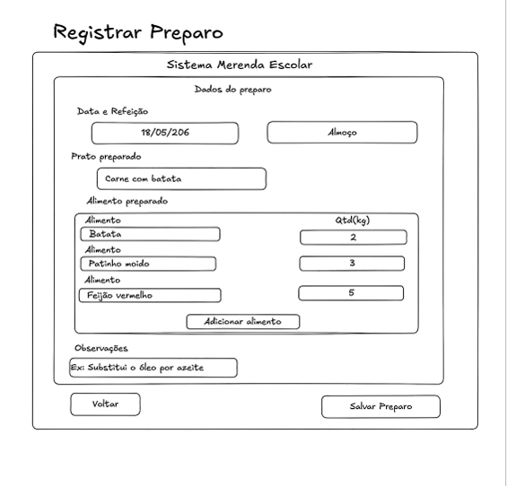
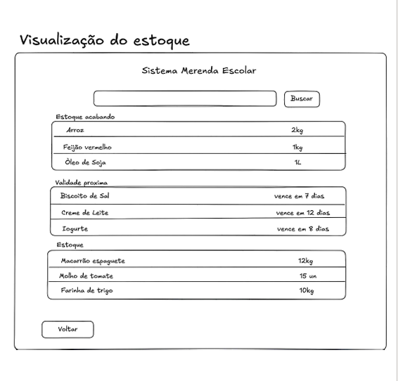
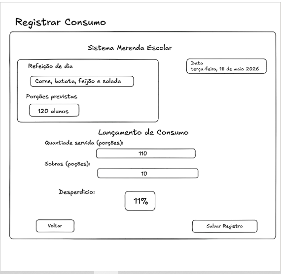
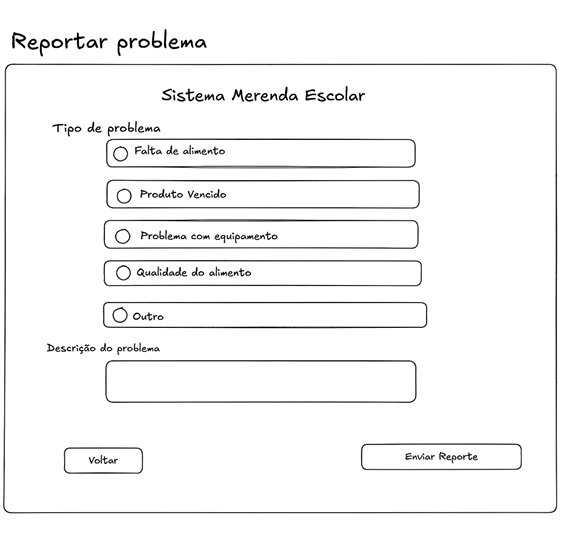
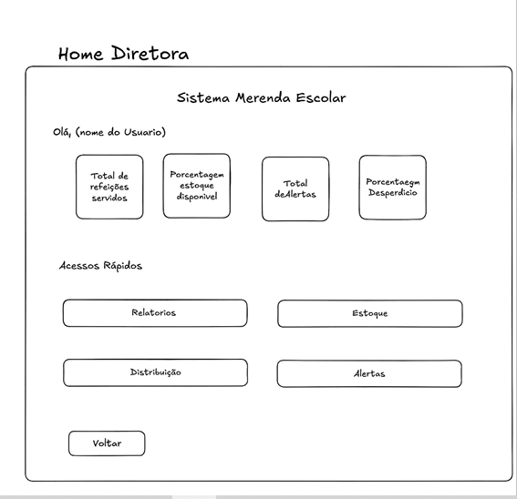
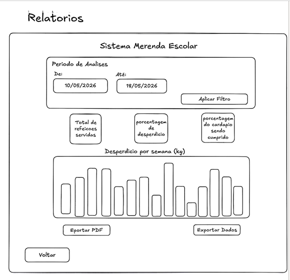
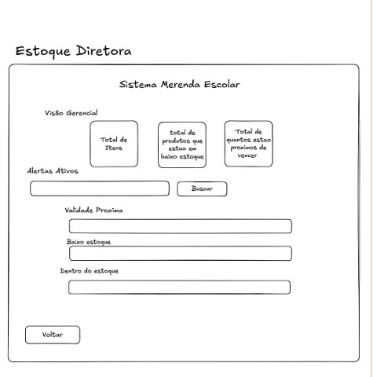
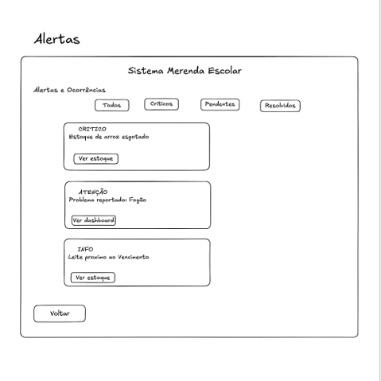
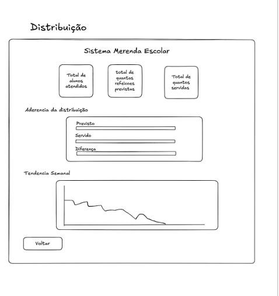

### User Flow

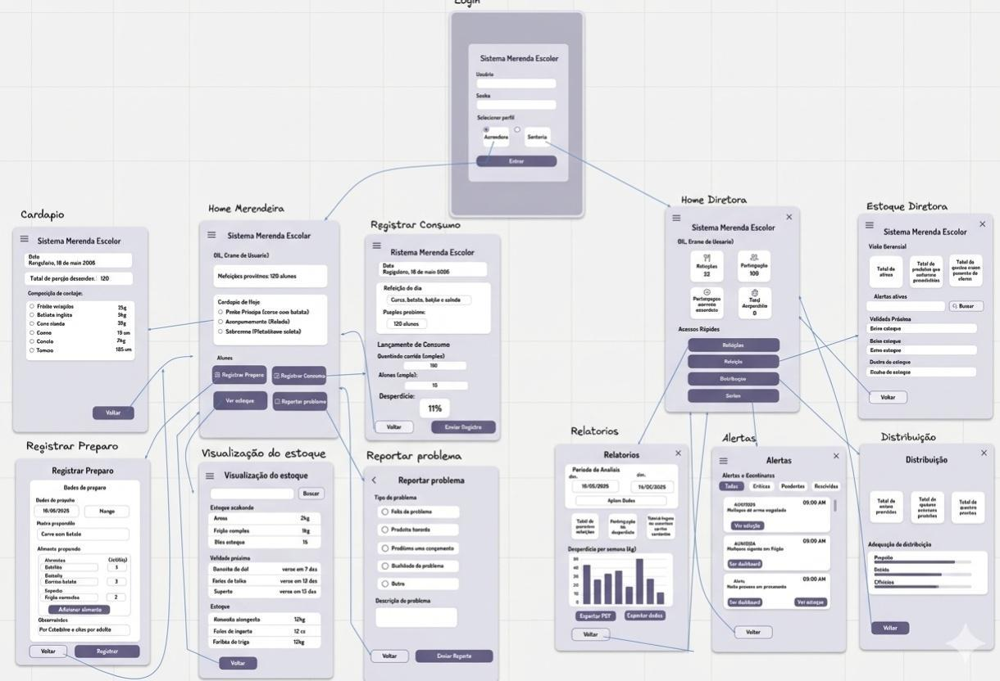

### Protótipo Interativo

✅ [Protótipo Interativo (MarvelApp)](https://marvelapp.com/prototype/97ca7h6) 
# Metodologia

O desenvolvimento do Merenda+ foi realizado utilizando metodologias ágeis, combinando Design Thinking para levantamento das necessidades dos usuários e Scrum para organização das atividades em três Sprints. A equipe utilizou GitHub para controle de versão do código. A comunicação entre os integrantes ocorreu por meio de reuniões no Discord e contato diário pelo WhatsApp, permitindo o acompanhamento do projeto, distribuição das atividades e integração contínua das funcionalidades desenvolvidas.

## Ferramentas

Relação de ferramentas empregadas pelo grupo durante o projeto.

| Ambiente                    | Plataforma | Link de acesso                                     |
| --------------------------- | ---------- | -------------------------------------------------- |
| Processo de Design Thinking | Miro       | https://miro.com/app/dashboard/        |
| Repositório de código     | GitHub     | https://github.com/ICEI-PUC-Minas-PPLES-TI/plf-es-2026-1-ti1-7620100-merenda-plus    |
| Protótipo Interativo       | MarvelApp  | https://marvelapp.com/prototype/97ca7h6 |
|                             |            |                                                    |

## Gerenciamento do Projeto

O projeto foi desenvolvido utilizando Design Thinking para identificar as necessidades dos usuários e Scrum para organizar o desenvolvimento em três Sprints. A comunicação da equipe ocorreu por meio de reuniões no Discord, conversas diárias pelo WhatsApp e versionamento do código no GitHub, permitindo a integração das funcionalidades e o acompanhamento da evolução do projeto.

As responsabilidades foram divididas entre os integrantes: 
 * Gabriel Pandino atuou como líder da equipe, organizando as tarefas e desenvolvendo funcionalidades como login por perfil, alertas, histórico de ocorrências e integração entre módulos; 
 * Gustavo Alves foi responsável pelo layout e pela lógica de diversas funcionalidades da aplicação; 
 * Davi Lavalle desenvolveu a documentação do projeto e auxiliou na organização das entregas; 
 * André Luiz Pinheiro participou da definição de ideias e do desenvolvimento de funcionalidades relacionadas ao controle da merenda escolar. Todas as implementações foram integradas e revisadas em conjunto pela equipe.

# Solução Implementada

O Merenda+ é uma aplicação Web desenvolvida para auxiliar o gerenciamento da merenda escolar em escolas públicas, proporcionando maior controle sobre o estoque, preparo e consumo dos alimentos, além de facilitar a comunicação entre merendeiras e diretoras.

O sistema possui autenticação por perfil, direcionando o usuário para funcionalidades específicas de acordo com seu tipo de acesso (Merendeira ou Diretora). A solução foi implementada utilizando HTML5, CSS3, JavaScript, Bootstrap e JSON Server para simulação do banco de dados.

Entre as principais funcionalidades implementadas estão:

* Login com seleção de perfil (Merendeira e Diretora);
* Controle e consulta de estoque de alimentos;
* Visualização do cardápio escolar;
* Registro do preparo da merenda;
* Registro do consumo diário;
* Reporte de problemas pelas merendeiras;
* Geração automática de alertas de baixo estoque e produtos próximos ao vencimento;
* Visualização e gerenciamento de ocorrências pela diretora;
* Marcação de ocorrências como resolvidas com armazenamento em histórico;
* Consulta ao histórico de alertas e ocorrências resolvidas;
* Perfil do usuário e navegação padronizada por meio de barras de navegação específicas para cada perfil.

A aplicação integra todas essas funcionalidades em um único ambiente, permitindo que informações registradas por um perfil sejam utilizadas por outro, como ocorre no fluxo de reportes → alertas → resolução → histórico, tornando o gerenciamento da merenda mais organizado, seguro e eficiente. Essa integração atende ao objetivo principal do projeto de oferecer uma solução digital para melhorar o controle da alimentação escolar e apoiar a tomada de decisão pelos responsáveis.

## Screenshots da aplicação

Para a apresentação do projeto em portfólio, foram registradas capturas da versão final preparada para demonstração.

As imagens estão disponíveis em [`portfolio/screenshots/`](portfolio/screenshots/) e apresentam os principais fluxos e interfaces do sistema, incluindo:

- login;
- painel da merendeira;
- reporte de problemas;
- painel da diretora;
- gerenciamento de reportes;
- controle de estoque;
- alertas e ocorrências.

Para uma visão geral do projeto, tecnologias utilizadas, instruções de execução e contribuições individuais, consulte o [README principal](../README.md).
